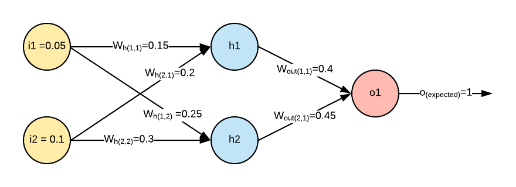

Neural Network is one of the ways to make a machine learn from data and is a type of Machine Learning technique.There are multiple Machine learning techniques but the power of the model is limited by the choice of algorithm say a decision tree algorithm or a Bayesian algorithm. In Neural netowrks there is no specific associated learning algorithm i.e the rules of learning are not explicitly mentioned and hence it gives the power to identify non-linear patterns in data where the relationship between the input and output is not straightforward.
    A simple neural network is illustrated below along with snippets of Python code.
  
NEURAL NETWORK INITIALIZATION

{:class="img-responsive"}  

  ```Jupyter Notebook
#Initialising variables
i = np.array ([[0.05,0.1]]) # Single record input array
o = np.array ([[1]]) # Output for the Single training example
output_neurons = 1
hidden_neurons = 2
wh= np.array ([[0.15,0.25],[0.2,0.3]]) # 2 x 2  matrix  - number of input features x number of hidden nodes
wout=np.array([[0.40],[0.45]]) # 2  x 1 - number of hidden nodes x number of output nodes
```
